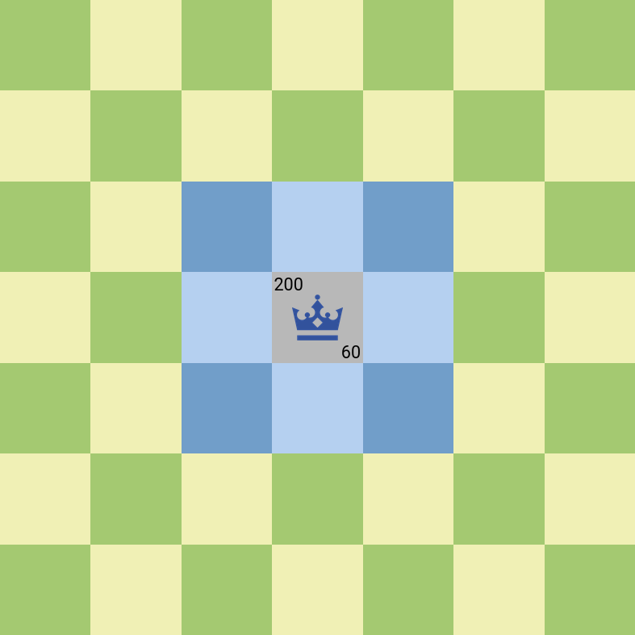
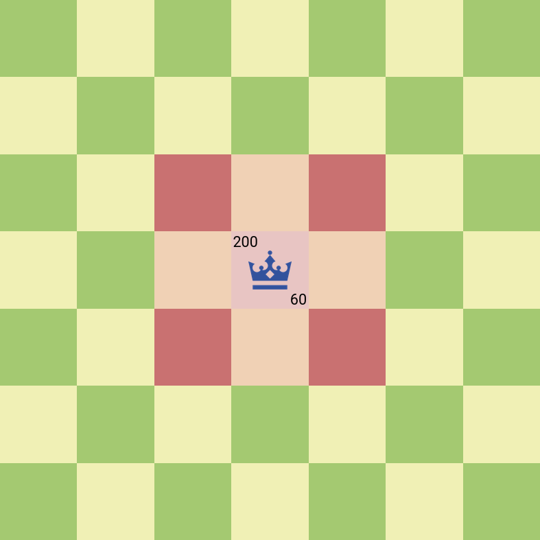
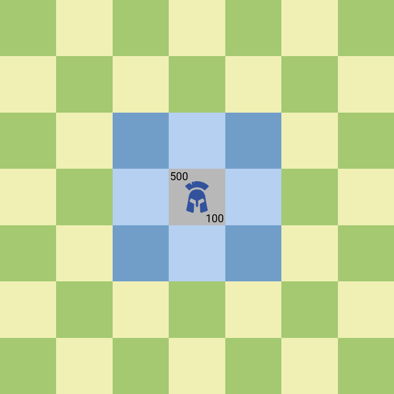
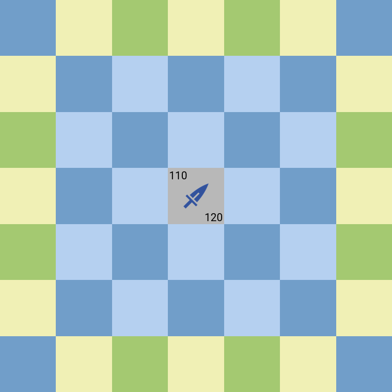
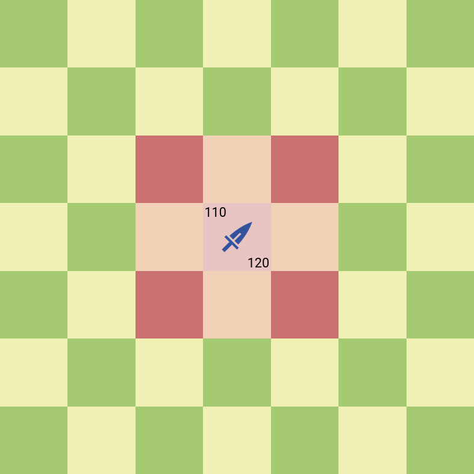
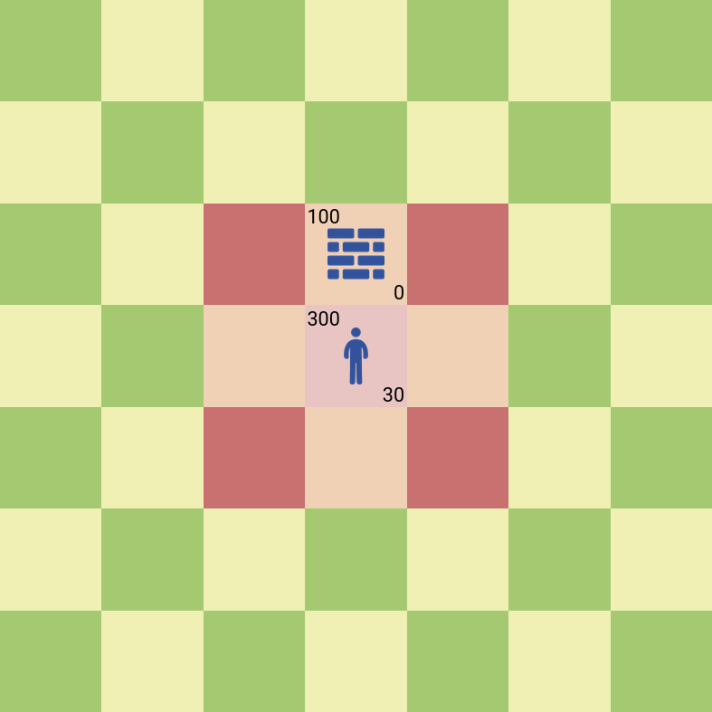

Units
#####

Units have 2 numbers above them. The left one is their health points(when this number becomes less than or
equal to 0, the unit is removed from the game) and the right one is their ability points.

King
****

Health points: 200

Ability points: 60

Ability: Single target damage.

Movement range:

|

Ability range:

Warrior
*******

Health points: 500

Ability points: 100

Ability: Single target damage.

Movement range:

|

Ability range:

.. image:: ../_static/warrior_ability.png

Mage
****

Health points: 230

Ability points: 80

Ability: AOE damage. If mage hits an enemy unit, all neighbouring enemy units also receive damage.

Movement range:

.. image:: ../_static/mage_move.png

|

Ability range:

.. image:: ../_static/mage_ability.png

Assassin
********

Health points: 110

Ability points: 120

Ability: Single target damage.

Note: Assassin can jump over other units.

Movement range:

|

Ability range:

Pawn
****

Health points: 300

Ability points: 30

Ability:

1) If used on an empty square: Creates a Wall.

2) If used on a square occupied by a Wall: Destroys the Wall.

3) If used on an enemy unit: Single target damage.

Movement range:

.. image:: ../_static/pawn_move.png

|

Ability range:

Wall
****

Health points: 100

Ability points: 0

Walls have no abilities and they can't move.

